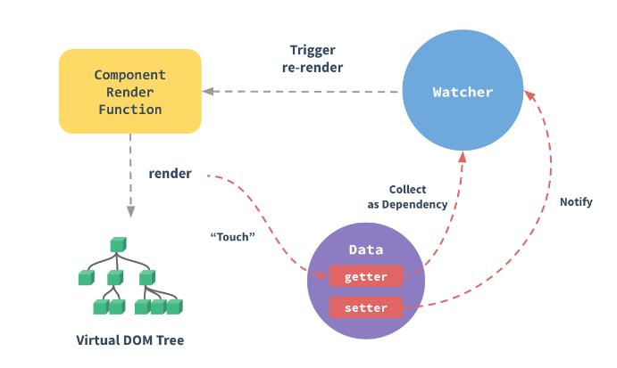
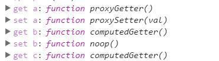
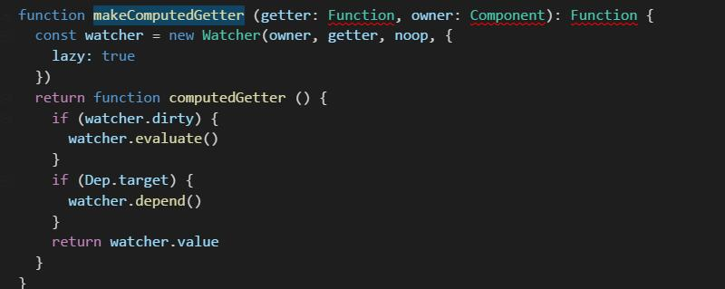
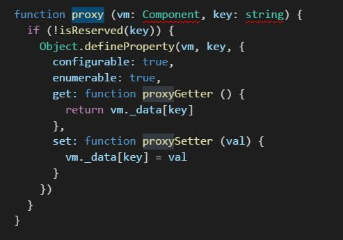
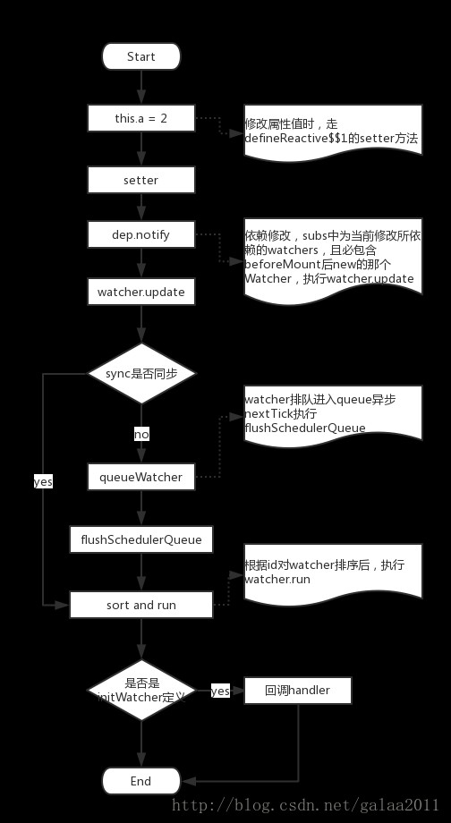

### 源码地址 https://github.com/vuejs/vue/tree/dev/src/core/observer
### 目录结构   
```bash
├── array.js                         # 覆盖数组原生方法  
├── dep.js                           # 依赖类  
├── index.js                         # 入口 主要为data添加get/set
├── scheduler.js                     # 管理消息队列 
└── watcher.js                       # 监听者  
```
### 解释
 <br/>
#### array
 ```bash
原生方法数组方法不能触发set/get方法
覆盖数组原生方法,触发dep.notify()(触发dep.notify)
 'push','pop','shift','unshift','splice','sort','reverse'
 ```
####  index    
```bash
1,初始化date,new Dep();添加get/set  
2,当数据get clollect as Dependency (收集依赖)=>dep.depend();
3,当数据set dep.notify（通知依赖）=>dep.notify
```
源码地址:src/core/instance/state<br/>
 <br/><br/>
  <br/>
computed只有get方法() lazy:true 默认缓存 数据缓存于watcher.value<br/><br/>
<br/>
data 有get/set方法<br/>
####  dep     
```bash
 get=>depend:触发所依赖watcher的addDep方法
 set=>notify:触发watchers 的update方法
```
####  watcher  
```bash
get=>depend 1,把watch.dep 添加依赖于该把watch的dep,2，为dep.subs添加该watch
set=>update=>run 

计算属性get=>watchers.get  1,给dep.target赋值 2,watcher的value给计算属性缓存
 
deep: true 递归watch
immediate: true 在创建watcher时就执行一次handler方法
sync: true 同步，直接执行watcher.run，否则要排队到queue数组中，等到nextTick异步到这里再依次执行
lazy: true 在创建watcher时是否需要立即计算当前watcher的value值，通过computed属性创建的watcher默认lazy=true不需要计算
```
####  scheduler     
```bash
1,queueWatcher 把watcher推入异步队列(去重)
2,flushSchedulerQueue 刷新异步队列 执行watcher.run
    flushSchedulerQueue保证以下几点
    1,组件更新从父到子。（因为父总是在孩子之前创建）
    2,组件的用户观察者在其呈现监视之前运行（因为用户观察者在呈现观察者之前创建）
    3,如果一个组件在父组件的监视程序运行时被破坏，它的观察者可以被跳过。
3,消息队列nextTick(src/util/env)
    1,实现方法（1,promise 2,MutationObserver 3，setTimeOut(0)）
    2,vue依次优先
        macrotasks: setTimeout setInterval setImmediate I/O UI渲染
        microtasks: Promise process.nextTick Object.observe MutationObserver
        js分成很对task,当task执行完毕，必然执行ui渲染，如果用setTimeout那么UI会渲染两次
        优先promise，MutationObserver为微任务，task执行完毕，找到微任务，并执行，UI自渲染一次
        MutationObserver实现，查看源码可以知道每次timer都会触发一个DOM更新count=(count+1)%2,DOM更新便会触发回调
```
### 待画序列图
1,收集依赖(主要是计算属性)
state.computedget(是不是脏数据,不是watch.value) ->watch.evaluate -> watch.get ->dep.pushtarget -Dep.target =computdwatcer ->执行依赖的get->有Dep.target->dep.add(watch)(因此当依赖变化时，把watch变为脏,下次就会刷新计算)->Dep.target=[];
2,触发更新
proxyset -> dep.notify -> (subs)watcher.update(如果lazy:true->dirty = true;页面绑定的有render watcher) ->  queueWatcher -> nextTick(flushSchedulerQueue保证3点)-> run -cb(user:自己的回调,render->updateComponent)

3,updateComponent _render2vnode  __patch__   vm.$el = vm.__patch__(prevVnode, vnode);
### 数据流图

 <br/>